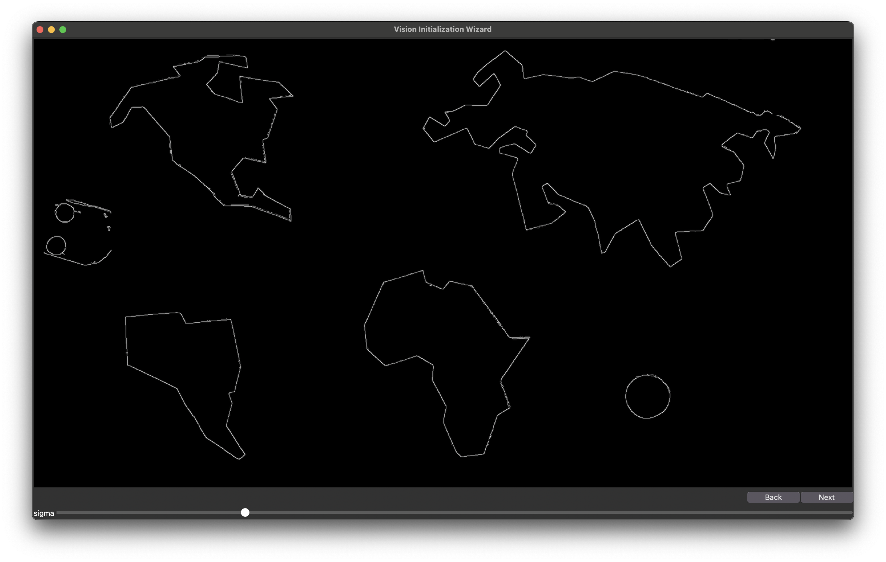
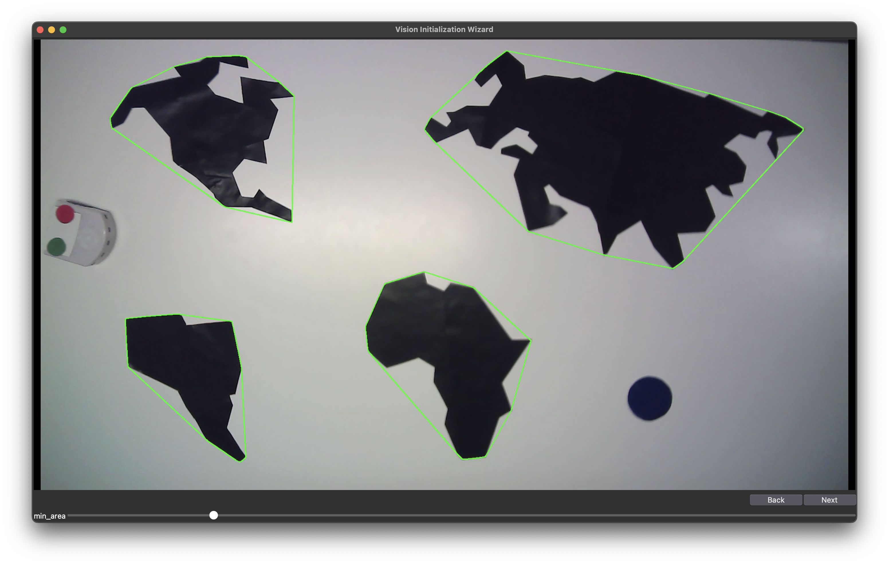
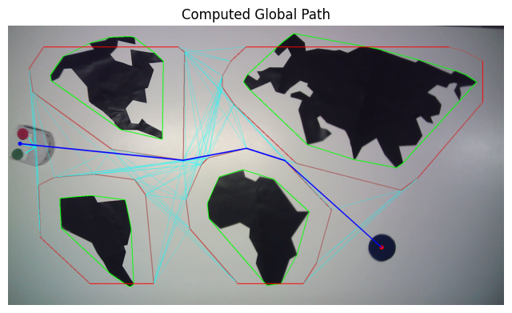

# Autonomous Mobile Robot Navigation

**EPFL — Basics of Mobile Robotics**

Autonomous navigation system for a **Thymio differential-drive robot**, combining computer vision, state estimation, global path planning, local obstacle avoidance, and low-level control.

The project was developed around a pirate-themed navigation task: the robot must autonomously travel from a starting location to a treasure goal while avoiding known obstacles detected by an overhead camera and unexpected obstacles encountered during navigation.

---

## Project Overview

The complete navigation pipeline consists of five main components:

```text
Overhead Camera
      ↓
Computer Vision
Robot pose • Goal • Obstacles
      ↓
Extended Kalman Filter
Camera measurements + Wheel odometry
      ↓
Global Path Planning
Obstacle processing + Visibility graph
      ↓
Local Navigation
Path following + Dynamic obstacle avoidance
      ↓
Low-Level Controller
Linear/angular velocity → Wheel commands
      ↓
Thymio Robot
```

The system allows the robot to:

- Detect its pose, the goal, and static obstacles using an overhead camera
- Estimate its state using an **Extended Kalman Filter**
- Compute a globally collision-free path
- Detect and avoid previously unknown obstacles using proximity sensors
- Rejoin the global path after avoiding an obstacle
- Follow the resulting trajectory using closed-loop motion control

---

## Computer Vision

The vision system extracts the information required for global navigation from an overhead camera.

The robot is identified using **red and green circular markers**, while the goal is detected using a colored marker.

Obstacle detection is based on:

1. HSV color segmentation
2. Median filtering
3. Canny edge detection
4. Morphological closing
5. Contour extraction
6. Convex polygon generation

The resulting detections provide:

- Robot position and orientation
- Goal position
- Polygonal representation of obstacles

<p align="center">
  
  
</p>

---

## State Estimation

Because both the camera and wheel odometry are affected by measurement uncertainty, an **Extended Kalman Filter (EKF)** is used to obtain a more robust estimate of the robot state.

The estimated state is:

```text
x = [x, y, θ]
```

where:

- `x`, `y` describe the robot position
- `θ` describes its orientation

The EKF combines:

- **Wheel odometry** for state prediction
- **Camera measurements** for state correction

The differential-drive motion model is nonlinear, requiring linearization at every estimation step.

The process and measurement covariance matrices were estimated experimentally using repeated trajectories on the physical robot.

---

## Global Path Planning

The global navigation module computes a collision-free path between the robot's starting position and the goal.

### Obstacle Processing

Raw obstacle polygons obtained from vision cannot be used directly because the planner considers the robot as a point.

To account for the physical size of the Thymio, obstacles are first **inflated by the robot radius** using a Minkowski-sum approximation.

Using Shapely:

```python
P.buffer(robot_radius_px, resolution=4, join_style=2)
```

Overlapping inflated obstacles are then merged, and the resulting geometry is clipped to the valid navigation workspace.

The complete preprocessing pipeline is therefore:

```text
Raw Obstacles
      ↓
Obstacle Inflation
      ↓
Merge Overlapping Obstacles
      ↓
Clip to Navigable Workspace
      ↓
Processed Obstacle Map
```

### Visibility Graph

A **visibility graph** is constructed using the vertices of the processed polygonal obstacles.

Two vertices can be connected when the segment between them:

- does not cross an obstacle
- remains inside the allowed workspace

The start and goal positions are inserted into the graph and connected to all visible vertices.

A shortest-path search is then used to obtain the globally optimal collision-free trajectory.

<p align="center">
  
</p>

---

## Local Navigation

Global planning handles the obstacles detected when the map is created. However, the robot may encounter **unexpected obstacles while moving**.

The local-navigation module therefore combines:

- Global-path tracking
- Proximity-sensor obstacle detection
- Local occupancy mapping
- Artificial potential fields

### Path Densification

The global path initially consists of a relatively small number of waypoints.

Intermediate points are inserted along the path to provide smoother tracking and ensure that the robot always has a nearby waypoint to follow.

### Lookahead Path Following

At every control step, the robot determines its position relative to the global path and selects a point a fixed distance ahead.

This produces a **lookahead point**, following a strategy similar to pure pursuit.

```text
Robot → Closest Path Point → Lookahead Point → Goal
```

---

## Robot-Centered Occupancy Grid

The Thymio's horizontal proximity sensors are used to detect local obstacles that were not included in the global map.

A local occupancy grid is maintained around the robot.

Each sensor measurement is:

1. Converted from raw sensor value to estimated distance
2. Converted into an obstacle position in the robot frame
3. Mapped to a cell in the occupancy grid

Each cell stores an occupancy value between `0` and `1`.

### Obstacle Inflation

Occupied cells are inflated to introduce a safety margin around detected obstacles.

### Occupancy Decay

The entire map gradually decays over time.

This allows obstacles that are no longer detected to disappear from the map rather than remaining permanently stored.

---

## Artificial Potential Field

Simply following the lookahead point is insufficient when an unexpected obstacle blocks the global path.

An **Artificial Potential Field (APF)** is therefore used to generate a temporary virtual goal.

The attractive component pulls the robot toward the lookahead point:

```text
F_att → Lookahead point
```

The repulsive component pushes the robot away from occupied cells:

```text
Obstacle → F_rep → Robot
```

The two forces are combined:

```text
F_total = F_att + F_rep
```

The direction of the resulting force defines a **virtual goal**.

The low-level controller follows this virtual goal, allowing the robot to bend around the obstacle before naturally converging back toward the global path.

When no significant local obstacle is detected, the repulsive force becomes zero and the robot follows the original global path.

---

## Low-Level Controller

The local navigator outputs a virtual goal in world coordinates.

The low-level controller converts this target into commands for the Thymio's left and right wheels.

The robot is modeled using the unicycle control inputs:

- Linear velocity `v`
- Angular velocity `ω`

### Linear Velocity

Forward velocity is proportional to the distance to the target:

```text
v = Kv · ρ
```

where `ρ` is the distance between the robot and the current virtual goal.

This naturally slows the robot as it approaches its target.

### Angular Velocity

Heading is controlled using a **PID controller**:

```text
ω = Kp·α + Ki∫αdt + Kd·dα/dt
```

where `α` represents the heading error.

Integral anti-windup and angular-velocity saturation are included to improve stability.

### Safety Heuristics

Additional rules use the Thymio proximity sensors as a final collision-avoidance layer.

When an obstacle becomes very close:

- Forward speed is reduced
- A minimum turning rate is enforced
- The robot turns toward the side with more available space

These heuristics complement the main navigation controller rather than replacing it.


### Robotics Concepts

- Mobile robot navigation
- Computer vision
- Extended Kalman Filtering
- Differential-drive kinematics
- Visibility graphs
- Shortest-path planning
- Occupancy grids
- Pure-pursuit-style path tracking
- Artificial potential fields
- PID control
- Sensor fusion

### Hardware

- Thymio II mobile robot
- Overhead camera
- Thymio horizontal proximity sensors

---

## Repository Structure

The project implementation is separated into Python modules, while the complete technical explanation and experiments are provided in the Jupyter notebook.

```text
mobile-robot-navigation/
│
├── src/                 # Navigation and control implementation
├── imgs/                # Figures and experimental results
├── docs/                # Project documentation
├── Report.ipynb         # Detailed technical report
└── README.md
```

For the complete mathematical derivations, implementation details, experimental methodology, and design decisions, see **`Report.ipynb`**.

---

## Team

Developed as part of the **Basics of Mobile Robotics** course at EPFL.

- **Andrea Tarabay**
- Jonathan Gos
- Jules Chabod
- Mehdi Belmajdoub
