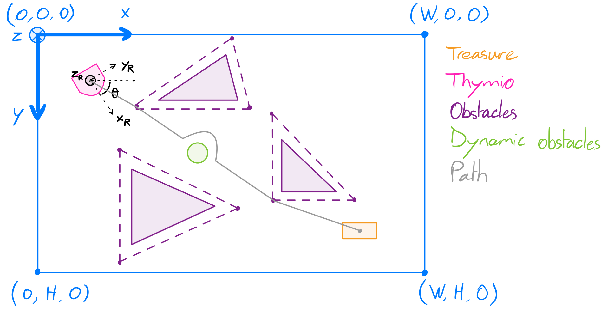
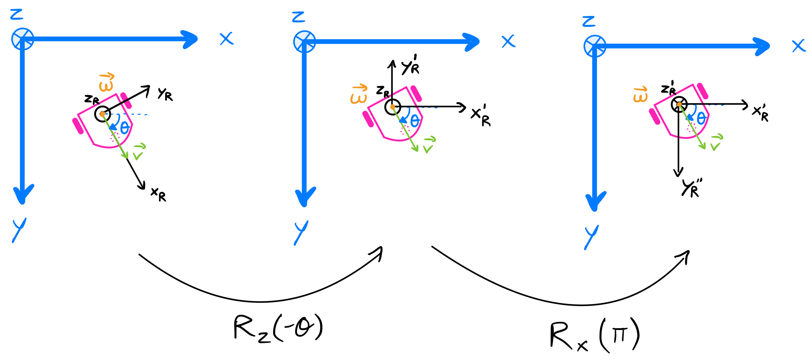

# Thymio on a treasure hunt

## Treasure map



## State-space model

### State variable definition

As we have seen, the state variable is the smallest possible subset of variables required to describe the evolution of the robot over time. It means that it should contain only the important quantities that are affecting the robot state and no redundant informations. For this project, we'll define the state of the Thymio as follow:

- Thymio is a differential dirve robot (DDR) with 3 DOFs, so three variables are required to describe its pose: $x$, $y$ and $\theta$

- Its dynamic can be represented solely using the norm of its forward and angular speed as explained in [1-Components of a Mobile Robot, slide 11](https://moodle.epfl.ch/pluginfile.php/2703472/mod_resource/content/13/Slides%2001%20-%20Components%20of%20a%20Mobile%20Robot.pdf). We'll denote them with: $v$ and $\omega$. The Astolfi controller gives their relation to the motors speeds as follow:

```math
\begin{equation}
    \begin{align*}
        v &= \frac{r\dot{\phi}_r}{2} + \frac{r\dot{\phi}_l}{2} \\
        \omega &= \frac{r\dot{\phi}_r}{2l}-\frac{r\dot{\phi}_l}{2l}
    \end{align*}
\end{equation}
```

Where $\dot{\phi}_i$ is the motor speed, $r$ the wheel radius and $l$ the axle length (total distance between both wheels is $2l$).

Hence, the complete state variable will be denoted as $\vec{x}(t) =
\begin{pmatrix}
  x\\ 
  y\\
  \theta\\
  v\\
  \omega
\end{pmatrix}$

### State-space equations

Expressing the Thymio’s state in a fixed reference frame relative to the map leads to a nonlinear system, because the robot’s velocity must be projected onto the reference axes using trigonometric (sine and cosine) terms. To map the velocities from the robot's referential frame to the global reference frame of the map, we use rotational matrices as we have seen in [1-Components of a Mobile Robot, slide 12](https://moodle.epfl.ch/pluginfile.php/2703472/mod_resource/content/13/Slides%2001%20-%20Components%20of%20a%20Mobile%20Robot.pdf):

- To align both x axis, we perform a rotation around the z axis of the global frame, using: $ R_z(-\theta) = R_z(\theta)^{-1} =
\begin{pmatrix}
    cos(\theta) & sin(\theta) & 0 \\
    -sin(\theta) & cos(\theta) & 0 \\
    0 & 0 & 1
\end{pmatrix}
$

- Then to reverse the z axis, we perform a rotation around the x axis of the global frame, using: $ R_x(\pi) =
\begin{pmatrix}
    1 & 0 & 0 \\
    0 & -1 & 0 \\
    0 & 0 & -1
\end{pmatrix}
$

- Both rotations are illustrated bellow:



Therefore, the velocities of the robot in the global referential frame are:

```math
\begin{equation}
    \begin{pmatrix}
        \dot{x} \\
        \dot{y} \\
        \dot{\theta}
    \end{pmatrix} = R_x(\pi)R_z(-\theta)
    \begin{pmatrix}
        v \\
        0 \\
        \omega
    \end{pmatrix} = 
    \begin{pmatrix}
        cos(\theta) & sin(\theta) & 0 \\
        sin(\theta) & -cos(\theta) & 0 \\
        0 & 0 & -1
    \end{pmatrix}
    \begin{pmatrix}
        v \\
        0 \\
        \omega
    \end{pmatrix} =
    \begin{pmatrix}
        vcos(\theta) \\
        vsin(\theta) \\
        -\omega
    \end{pmatrix}
\end{equation}
```

And we can use then to define the state-space equations:

```math
\begin{equation}
    \begin{align*}
        \vec{x}_{k} &= 
            \begin{pmatrix}
                x_{k}\\ 
                y_{k}\\
                \theta_{k}\\
                v_{k}\\
                \omega_{k}
            \end{pmatrix} 
            = \boldsymbol{g}(\vec{x}_{k-1}, \vec{u}_k) = 
            \begin{pmatrix}
                x_{k-1} + t_s \cdot v_{k-1} \cdot cos(\theta_{k-1})\\ 
                y_{k-1} + t_s \cdot v_{k-1} \cdot sin(\theta_{k-1})\\
                \theta_{k-1} - t_s \cdot \omega_{k-1}\\
                \frac{r\dot{\phi}_r}{2} + \frac{r\dot{\phi}_l}{2}\\
                \frac{r\dot{\phi}_r}{2l}-\frac{r\dot{\phi}_l}{2l}
            \end{pmatrix} =
            \begin{pmatrix}
                x_{k-1} + t_s \cdot v_{k-1} \cdot cos(\theta_{k-1})\\ 
                y_{k-1} + t_s \cdot v_{k-1} \cdot sin(\theta_{k-1})\\
                \theta_{k-1} - t_s \cdot \omega_{k-1}\\
                \frac{\lambda}{2} (u_{rk} + u_{lk})\\
                \frac{\lambda}{2l} (u_{rk} - u_{lk})
            \end{pmatrix} \quad \text{with} \quad \vec{u}_k =
                \begin{pmatrix}
                    u_{rk} \\
                    u_{lk}
                \end{pmatrix} \\
        \vec{z}_k &= 
            \begin{pmatrix}
                x_{k,measured} \\
                y_{k,measured} \\
                \theta_{k,measured} \\
                u_{r,k,measured}\\
                u_{l,k,measured}
            \end{pmatrix} = \boldsymbol{h}(\vec{x}_{k}) =
            \begin{pmatrix}
                x_k \\
                y_k \\
                \theta_k \\
                \frac{1}{\lambda}(v_k + l\omega_k)\\
                \frac{1}{\lambda}(v_k - l\omega_k)
            \end{pmatrix}
    \end{align*}
\end{equation}
```