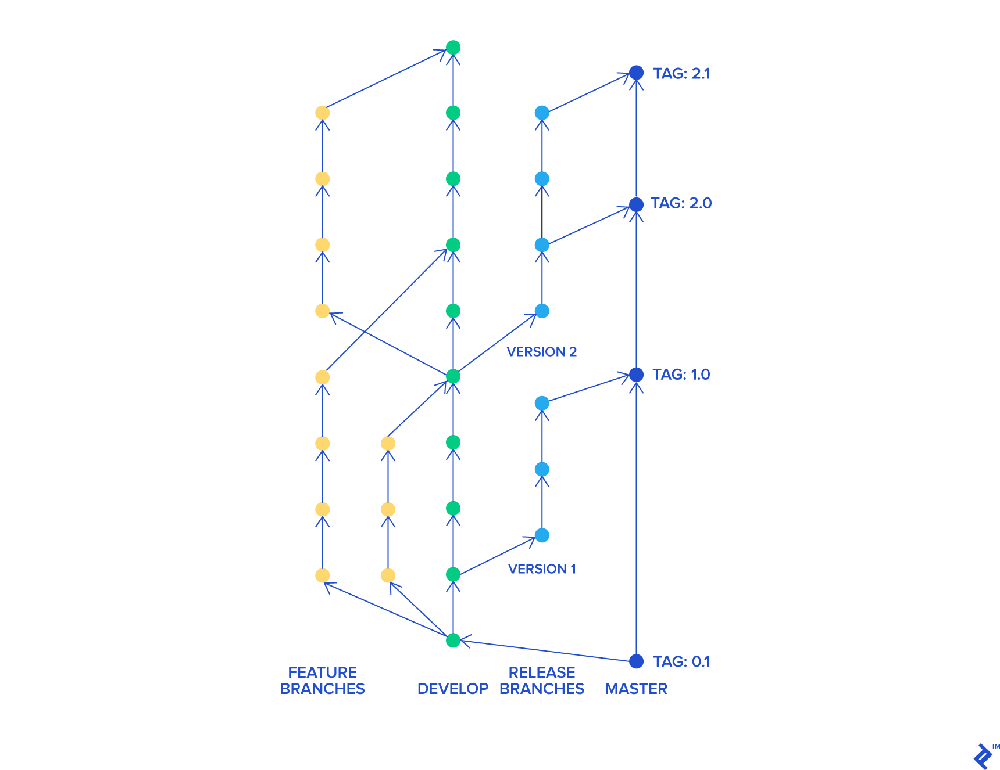

# Project workflow

## Git flow



**Default branches:**
- `computer-vision`: feature branch for extracting map features
- `global-navigation`: feature branch for path planning
- `local-navigation`: feature branch for obstacle avoidance
- `motion-control`: feature branch for basic control algorithm
- `pose-estimation`: feature branch for state estimation
- `dev`: main development branch where features are merged and tested
- `main`: when dev has reached a sufficient maturity, it is merged in main as a release

## Repository structure

```text
.
├── docs/                           # Helpful documents
│ ├── git_cheat_sheet.pdf 
│ ├── markdown_cheat_sheet.md 
│ └── project_workflow.md 
├── notebooks/                      # Jupyter Notebooks for development and report
| ├── ...
│ └── final_report.ipynb            # Final submission notebook
├── src/                            # Core source code (only .py or .aseba files)
│ ├── computer_vision/ 
│ ├── global_navigation/ 
│ ├── local_navigation/ 
│ ├── motion_control/ 
│ ├── pose_estimation/ 
│ ├── utils/ 
│ └── main.py 
├── tests/                          # Optional
├── .gitignore 
└── README.md                       # Main README (project overview)
```

Each subsystem can be developed under /src/subsys_name and tested in its own notebook under /notebooks/.
Only the final integrated notebook (Final_Report.ipynb) should be cleaned and used for submission.

`utils` can be used for code that is common to different subsystems.